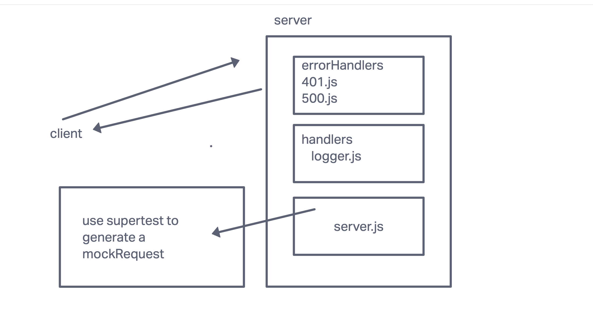

# LAB - Class xx

## Project: Server Deployment Practice

### Author: Bryan O. Garduno Gonzalez

### Problem Domain  

API server where we write some middleware and practice deployment. 

### Links and Resources

- [GitHub Actions ci/cd](https://github.com/brosmar18/server-deployment-practice/actions) 
- Dev [back-end server url](https://lab01-practice.onrender.com) (when applicable)
- Main [back-end server url]() (when applicable)
- [front-end application](http://xyz.com) (when applicable)

### Collaborators

### Setup

#### `.env` requirements (where applicable)

i.e. not necessary for this lab, will come later. 

#### How to initialize/run your application (where applicable)

- e.g. `npm start`

#### How to use your library (where applicable)

#### Features / Routes

- Feature One: Deploy as dev branch once ci/cd works!

#### Tests

<!-- Fill this in as you see fit -->

- How do you run tests?
- Any tests of note?
- Describe any tests that you did not complete, skipped, etc

#### UML

